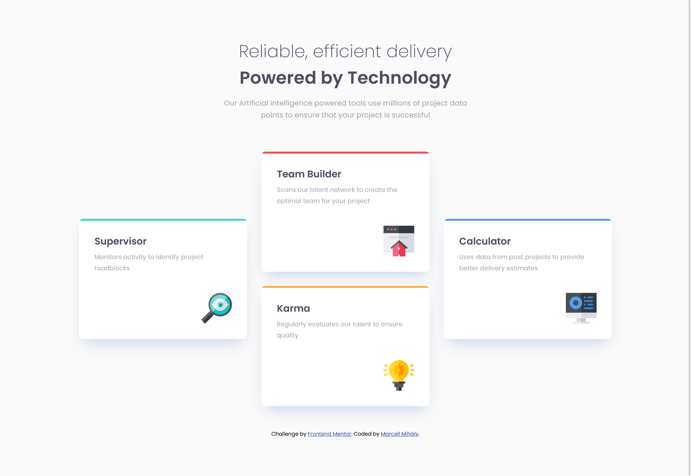
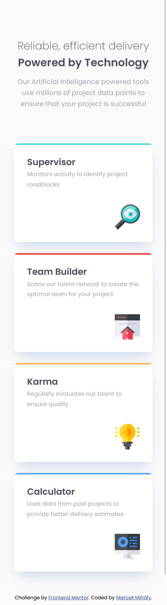

# Frontend Mentor - Four card feature section solution

This is a solution to the [Four card feature section challenge on Frontend Mentor](https://www.frontendmentor.io/challenges/four-card-feature-section-weK1eFYK). Frontend Mentor challenges help you improve your coding skills by building realistic projects.

## Table of contents

- [Overview](#overview)
  - [The challenge](#the-challenge)
  - [Screenshot](#screenshot)
  - [Links](#links)
- [My process](#my-process)
  - [Built with](#built-with)
  - [What I learned](#what-i-learned)
- [Author](#author)

## Overview

### The challenge

Users should be able to:

- View the optimal layout for the site depending on their device's screen size

### Screenshot

Desktop

---

Mobile

### Links

- Solution URL: [https://github.com/mihalymarcell86/four-card-feature-section](https://github.com/mihalymarcell86/four-card-feature-section)
- Live Site URL: [https://mihalymarcell86.github.io/four-card-feature-section/](https://mihalymarcell86.github.io/four-card-feature-section/)

## My process

### Built with

- Semantic HTML5 markup
- Sass, Flexbox and Grid

### What I learned

I usually use `grid-template-areas` when it comes to more complicated grid layouts, however I felt like that would be an overkill for this particular project, and I assigned each grid element to a particular row / column. I came to the realization, that the `grid-row` and `grid-column` properties are pretty much the 2D equivalents of the Flexbox `order` property.

## Author

- GitHub - [@mihalymarcell86](https://www.github.com/mihalymarcell86)
- Frontend Mentor - [@mihalymarcell86](https://www.frontendmentor.io/profile/mihalymarcell86)
